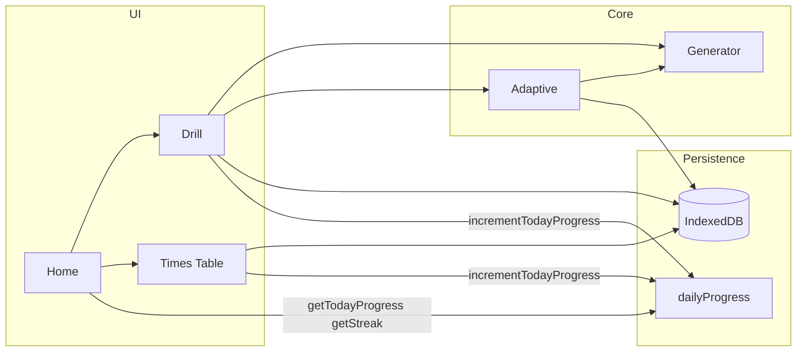

# 兒童算術練習 Web App 實作計畫

## 1. 專案結構

```
cursor-ai-jamie-related/
├── app/
│   ├── layout.tsx              # 根 layout，字體與 Tailwind
│   ├── page.tsx                 # 首頁：選擇 Drill / Times Table
│   ├── drill/
│   │   └── page.tsx             # Drill 模式：設定 → 答題流程 → 結束畫面
│   └── times-table/
│       └── page.tsx             # Times Table：Flashcards / Speed Quiz
├── src/                         # 或 lib/，依慣例擇一
│   ├── generator/               # 題目生成模組
│   │   ├── index.ts
│   │   ├── types.ts
│   │   └── difficulty.ts       # 難度分層邏輯（進位/借位、乘除優先數字）
│   ├── adaptive/               # 自適應引擎
│   │   ├── index.ts             # 權重更新 + 抽樣（80% 高權重 / 20% 低權重）
│   │   └── types.ts
│   ├── persistence/             # IndexedDB
│   │   ├── db.ts                # 開 DB、stores、版本遷移
│   │   ├── sessions.ts          # 寫入/讀取 session、attempts
│   │   ├── skills.ts            # 讀寫 skill 權重（如 mul_7x8）
│   │   ├── dailyProgress.ts     # 今日任務：每日題數、完成時間、streak
│   │   └── export-import.ts     # 匯出/匯入 JSON
│   └── components/              # UI 元件
│       ├── TodayTask.tsx        # 今日任務卡片（X/20、進度條、連續天數、徽章）
│       ├── NumericKeypad.tsx    # 自訂數字鍵盤（0–9、清除、送出）
│       ├── QuestionCard.tsx     # 單題大字顯示（a op b = ?）
│       ├── FeedbackToast.tsx    # 即時對錯與反應時間
│       ├── DrillSettings.tsx    # 運算、範圍、題數、難度
│       ├── DrillEndScreen.tsx   # 準確率、平均時間、Retry wrong
│       ├── Flashcard.tsx        # 點擊翻面（題目 / 答案）
│       └── SpeedQuiz.tsx        # 60 秒計時 + 連續答題
├── __tests__/
│   ├── generator/
│   │   └── index.test.ts        # 加減乘除規則、範圍、難度、無負數、整數除
│   └── adaptive/
│       └── index.test.ts        # 權重增減、抽樣比例
├── package.json
├── tailwind.config.ts
├── tsconfig.json
└── README.md
```

- **Generator**：只負責產生題目與難度標記，不依賴 React。
- **Adaptive**：輸入/輸出為 attempts 與 skill keys，便於純函式測試。
- **Persistence**：使用 `idb` 或原生 `indexedDB` 封裝；所有存取為非同步，在 client 端呼叫（必要時用 `'use client'` 或 Server Component 內不直接碰 DB）。

---

## 2. 技術選型與依賴

- **Next.js 14+**（App Router）、**TypeScript**、**Tailwind CSS**。
- **IndexedDB**：可用 [idb](https://www.npmjs.com/package/idb) 簡化 Promise API 與 schema（stores: `sessions`、`attempts`、`skillWeights`、`dailyProgress`）。
- **測試**：Jest + `@testing-library/react`（若需測元件），或僅用 Jest 測 `generator` 與 `adaptive` 的純邏輯。
- **無需登入**：所有資料僅存於本機。

---

## 3. 核心模組規格

### 3.1 Generator（`[src/generator/](src/generator/)`）

- **介面**：`generateQuestion(options)`  
  - `options`: `{ operation, rangeMin, rangeMax, difficulty?, count?, skillKey? }`  
  - 回傳：`{ a, b, op, answer, skillKey, hasCarry?, hasBorrow? }` 或陣列。
- **規則**：
  - **減法**：`a >= b`（同一範圍內隨機 a,b 並確保 a ≥ b）。
  - **除法**：僅整數除；由 `b * q` 得被除數，再輸出 `(b*q, b)` 或 `(b*q, q)` 依題型。
  - **難度**（`[difficulty.ts](src/generator/difficulty.ts)`）：
    - 加/減：easy 無進/借位，normal/hard 可含進位/借位。
    - 乘：easy 以 2/5/10 為主，normal 3/4/6，hard 7/8/9。
    - 除：與乘法對應（僅出 1–9 乘法表內之整數除）。
- **範圍**：依 UI 的 0–10 / 0–20 / 0–100 傳入 `rangeMax`（及可選 `rangeMin`）。

### 3.2 Adaptive Engine（`[src/adaptive/](src/adaptive/)`）

- **Skill key**：字串如 `add_7_9`、`sub_12_5`、`mul_7x8`、`div_56_7`（與 generator 協定一致）。
- **權重更新**（每題結束後呼叫）：
  - 答錯：`weight += 3`
  - 答對但慢（例如 &gt; 閾值 5s）：`weight += 1`
  - 答對且快：`weight -= 1`，下限 0。
- **抽樣**：
  - 將 skills 依權重排序，取高權重 pool（例如 top 50%）與低權重 pool（其餘）。
  - 80% 從高權重 pool 抽 skill，20% 從低權重 pool 抽；再依該 skill 呼叫 generator 產生題目。
- **介面**：`updateWeight(skillKey, { correct, responseTimeMs })`、`getNextSkillKey(weightsMap)` 或 `sampleQuestions(weightsMap, count)` 回傳題目陣列。

### 3.3 Persistence（`[src/persistence/](src/persistence/)`）

- **Schema**：
  - **sessions**：`id, mode, startedAt, endedAt?, settings?`
  - **attempts**：`id, sessionId, question, correct, responseTimeMs, skillKey, createdAt`
  - **skillWeights**：`skillKey (key), weight (number)`
  - **dailyProgress**：`date (key, YYYY-MM-DD 當地)`, `questionsCompleted`, `completedAt?`（當日達 20 題時寫入）
- **API**：`saveSession`、`getSessions`、`saveAttempt`、`getAttemptsBySession`、`getAllWeights`、`saveWeights`（可單筆或 batch）；**今日任務**：`getTodayProgress()`、`incrementTodayProgress()`（Drill / Speed Quiz 每答一題呼叫）、`getStreak()`、`getRecentBadgeDays()`（見 `dailyProgress.ts`）。
- **Export/Import**：`exportToJson()` → 下載 JSON；`importFromJson(file)` → 解析後寫入 DB；需一併匯出/匯入 `dailyProgress`。

---

## 4. 頁面與流程

### 4.1 首頁（`[app/page.tsx](app/page.tsx)`）

- **今日任務**（`[TodayTask](src/components/TodayTask.tsx)`）：顯示「今天已完成 X / 20 題」、進度條；若 X &lt; 20 顯示「再 N 題就完成今日任務！」；若 X ≥ 20 顯示「今日任務完成！」與今日徽章；並顯示「已連續 K 天完成」，K ≥ 7 時顯示 7 天連續徽章。
- 兩個大按鈕：**Drill**、**Times Table**。
- 簡短說明與 kid-friendly 配色（例如鮮明但不刺眼、大按鈕、圓角）。

### 4.2 Drill 模式（`[app/drill/page.tsx](app/drill/page.tsx)`）

- **Step 1 – 設定**（`[DrillSettings](src/components/DrillSettings.tsx)`）：  
運算（+ / − / × / ÷）、範圍（0–10 / 0–20 / 0–100）、題數（10 / 20 / 不限）、難度（easy / normal / hard）。  
若啟用「自適應」，則題目來源改為 adaptive 抽樣（仍可限制題數或時間）。
- **Step 2 – 答題**：  
一題一屏、大字題目（`[QuestionCard](src/components/QuestionCard.tsx)`）、自訂數字鍵盤（`[NumericKeypad](src/components/NumericKeypad.tsx)`）、送出後即時反饋（對/錯 + 反應時間），並寫入 `attempts`、更新 adaptive 權重、呼叫 `incrementTodayProgress()`（若回傳 `justCompleted: true` 可顯示「今日任務完成！」toast）。
- **Step 3 – 結束**（`[DrillEndScreen](src/components/DrillEndScreen.tsx)`）：  
顯示準確率、平均反應時間；按鈕「再練錯題」可只把本 session 錯題重新排成新的一輪。

### 4.3 Times Table 模式（`[app/times-table/page.tsx](app/times-table/page.tsx)`）

- **子模式選擇**：Flashcards / Speed Quiz。
- **Flashcards**（`[Flashcard](src/components/Flashcard.tsx)`）：  
每張卡片正面為「7 × 8 = ?」，點擊翻面顯示 56；可左右切換下一張，涵蓋 1–9 × 1–9。
- **Speed Quiz**（`[SpeedQuiz](src/components/SpeedQuiz.tsx)`）：  
60 秒倒數，一題接一題，用數字鍵盤輸入答案，即時對錯；每答一題呼叫 `incrementTodayProgress()`（可選：達 20 題時顯示「今日任務完成！」toast）；結束後顯示答對題數與準確率。

### 4.4 今日任務與連續徽章（教育產品加分）

- **每日目標**：每天完成 **20 題**（Drill 與 Times Table 速度測驗皆計入；閃卡不計）。
- **今日徽章**：當日達 20 題即算完成今日任務，給予今日徽章（首頁顯示「今日任務完成！」與徽章圖示／文字）。
- **連續 7 天獎勵**：連續 7 天都達成每日 20 題時，給予 **7 天連續徽章**；首頁顯示「已連續 K 天完成」，K ≥ 7 時顯示 7 天徽章。
- **計數時機**：Drill 每答一題（`saveAttempt` 後）呼叫 `incrementTodayProgress()`；Speed Quiz 每答一題（`handleSubmit` 內）呼叫 `incrementTodayProgress()`。日期以使用者當地 `YYYY-MM-DD` 為準。
- **即時回饋**：`incrementTodayProgress()` 回傳 `justCompleted: true` 時（當日從 19→20 題），可顯示「今日任務完成！獲得今日徽章。」toast；連續天數剛達 7 時可顯示「7 天連續達成！」toast。

---

## 5. UI / 樣式要點

- **字體**：大而清晰的無襯線字體（例如 `font-sans` 或 Google Fonts 的 Nunito / Fredoka）。
- **按鈕**：大、圓角、明確的 hover/active 狀態，方便兒童點擊。
- **顏色**：對＝綠、錯＝紅；背景與對比適合長時間使用。
- **鍵盤**：0–9、清除（C）、送出（✓），僅數字輸入，防止誤觸其他鍵。
- **一題一屏**：Drill 題目與鍵盤為主體，減少干擾。

---

## 6. 資料流概觀



- 設定完成後，Drill 依是否啟用自適應決定呼叫 `Generator` 直接出題或先經 `Adaptive.sampleQuestions`。
- 每題結束：寫入 attempt → 更新 skill 權重 → 呼叫 `incrementTodayProgress()`（Drill 與 Times Table 速度測驗）；若為 Drill 則寫入 session。
- 今日任務：首頁讀取 `dailyProgress` 顯示 X/20 與連續天數；達 20 題當日寫入 `completedAt`，連續 7 天完成可顯示 7 天徽章。
- Export/Import 需包含 `dailyProgress`。

---

## 7. 測試策略

- **Generator**（`[__tests__/generator/index.test.ts](__tests__/generator/index.test.ts)`）：
  - 加法：結果在範圍內；難度與進位與否一致。
  - 減法：`a >= b`，無負數。
  - 乘法：因數與難度分層（2/5/10 vs 7/8/9）符合。
  - 除法：僅整數、商在 1–9、與乘法表一致（即 `b * q` 可還原）。
- **Adaptive**（`[__tests__/adaptive/index.test.ts](__tests__/adaptive/index.test.ts)`）：
  - 權重：答錯 +3、慢對 +1、快對 -1、不小於 0。
  - 抽樣：大量樣本下高/低權重比例約 80/20（可設容差）。

---

## 8. README 內容建議

- 專案簡介與功能列表（Drill、Times Table、自適應、今日任務與連續徽章、本地儲存）。
- 環境需求：Node 18+。
- 安裝：`npm install`；啟動：`npm run dev`。
- 測試：`npm test`。
- Export/Import 使用方式：從設定或首頁進入「匯出」下載 JSON；「匯入」選擇檔案並覆寫或合併（簡短說明）。
- 技術棧：Next.js、TypeScript、Tailwind、IndexedDB。

---

## 9. 實作順序建議

1. 初始化 Next.js + TS + Tailwind，安裝 `idb`、Jest 等。
2. 實作 **Generator**（含難度）並通過單元測試。
3. 實作 **Adaptive** 權重與抽樣並通過單元測試。
4. 實作 **Persistence**（DB schema、sessions、attempts、skillWeights、export/import）。
5. 實作 **首頁** 與 **Drill** 流程（設定 → 答題 → 結束、Retry wrong）。
6. 實作 **Times Table**（Flashcards + Speed Quiz）。
7. 整合自適應到 Drill（可選開關），並確保每題寫入 attempt 與權重。
8. 收斂樣式、鍵盤與反饋體驗，補齊 README。
9. **今日任務與連續徽章**：新增 `dailyProgress` store 與 `dailyProgress.ts`（`getTodayProgress`、`incrementTodayProgress`、`getStreak`、`getRecentBadgeDays`）；Drill 與 Speed Quiz 每答一題呼叫 `incrementTodayProgress()`；首頁加入 `TodayTask` 元件顯示 X/20、進度條、連續 K 天、今日完成與 7 天徽章；可選在達 20 題或連續 7 天時顯示 toast；Export/Import 納入 `dailyProgress`。日期以使用者當地 YYYY-MM-DD 為準。

此計畫涵蓋專案結構、模組職責、數學與自適應規則、DB 設計、今日任務與徽章、測試範圍與交付項目，可直接依此拆分任務實作。