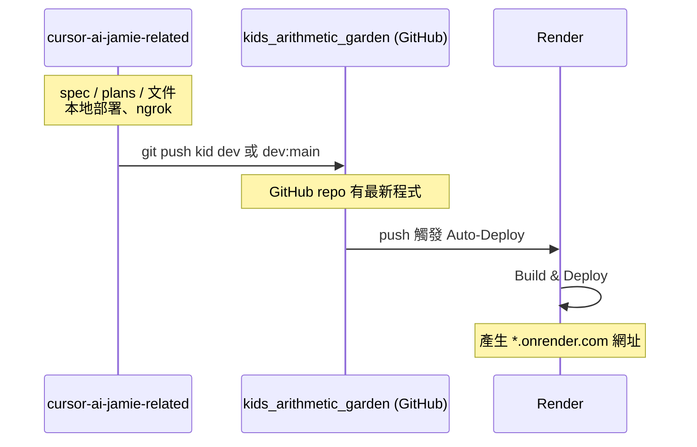

# 推送到 kids_arithmetic_garden 並部署至 Render

## 兩目錄角色


| 目錄                          | 路徑                                                                | 用途                                                       |
| --------------------------- | ----------------------------------------------------------------- | -------------------------------------------------------- |
| **cursor-ai-jamie-related** | `/Users/Mac/Documents/SourceTree Project/cursor-ai-jamie-related` | 存放 spec、plans、markdown、規格文件等；**本地部署**與 **ngrok** 在此目錄運行。 |
| **kids_arithmetic_garden**  | `/Users/Mac/Documents/SourceTree Project/kids_arithmetic_garden`  | 實際部署到 **Render** 的專案；推送到此 repo 的遠端即會觸發 Render 部署。        |


---

## 目前功能與架構（截至文檔更新日）

### 技術棧與資料

- **框架**：Next.js（App Router）、React、TypeScript。
- **儲存**：瀏覽器端 **IndexedDB**（idb），無後端 API；DB 名稱 `kid-arithmetic-db`，版本 3。
- **Store**：`sessions`、`attempts`、`skillWeights`、`dailyProgress`、`wallet`、`inventory`、`garden`。
- **花園造訪時間**：`localStorage` 鍵 `garden_last_visit`，用於雜草判定。

### 頁面與路由


| 路徑             | 說明                                                                                       |
| -------------- | ---------------------------------------------------------------------------------------- |
| `/`            | 首頁：Kids Arithmetic Garden 介紹、代幣顯示、🏪 商店 / 🌱 我的花園 / 📋 今日任務 入口、練習題 / 九九乘法 連結、匯出／匯入 JSON。 |
| `/drill`       | 練習題：自訂練習、綜合題／加／減／乘／除速度測驗（60 秒，80% 給不同代幣）。                                                |
| `/garden`      | 我的花園：種植、澆水、施肥、鬆土、噴霧、剪雜草、除蟲（噴殺蟲劑／徒手抓蟲）。                                                   |
| `/shop`        | 商店：代幣購買種子、水、肥料、殺蟲劑、擴充背包、園藝工具、水壺外觀、背包外觀。                                                  |
| `/today`       | 今日任務：每日固定題數（20 題），完成可領今日獎勵＋連續 7 天額外代幣。                                                   |
| `/times-table` | 九九乘法表。                                                                                   |


### 代幣與獎勵（wallet）

- **取得代幣**：今日任務完成（6 代幣）、連續 7 天完成（+10）、練習／速度測驗答對率 ≥ 80%（2～6 依模式）。
- **速度測驗代幣**：綜合題 6、加法 1、減法 2、乘法 3、除法 3（皆 80% 門檻）。
- **API**：`getCoins`、`addCoins`、`awardCompletionReward`、`awardCustomCompletionReward`、`claimDailyRewardIfEligible`。

### 花園（garden + gardenVisit）

- **成長**：`growthValue` 依時間與澆水／施肥／鬆土／噴霧計算，階段 0～4（開花=4）；雜草或蟲害會乘上懲罰係數。
- **雜草**：`getHasWeeds()` 依「上次造訪或上次剪草」是否超過 **12 小時**判定；剪完或造訪會更新 `garden_last_visit`，剪雜草有 3 小時冷卻。
- **蟲害**：進入花園時若 `growthStage >= 1` 且目前無蟲，**15% 機率**觸發蟲害；除蟲方式：噴殺蟲劑（消耗 1）或徒手抓蟲（冷卻 2 小時）。
- **其他**：鬆土／噴霧冷卻 5 分鐘；商店可買種子、水、肥料、殺蟲劑、工具、水壺與背包外觀。

### 練習與今日任務

- **練習題**：自訂題數與運算類型，可選適應式出題（依 skillWeights）；結束時答對率 ≥ 80% 給 2 代幣。
- **速度測驗**：MixedSpeedQuiz（綜合）、OperationSpeedQuiz（加／減／乘／除），60 秒、10 題，80% 給對應代幣。
- **今日任務**：`/today` 固定 20 題（`TODAY_SET_SIZE`），完成後可領每日獎勵；進度與連續天數存於 `dailyProgress`。

### 關鍵檔案（cursor-ai-jamie-related）


| 類別        | 路徑                                                                                |
| --------- | --------------------------------------------------------------------------------- |
| 花園狀態與操作   | `src/persistence/garden.ts`                                                       |
| 花園造訪／雜草   | `src/persistence/gardenVisit.ts`                                                  |
| 代幣        | `src/persistence/wallet.ts`                                                       |
| 資料庫與型別    | `src/persistence/db.ts`                                                           |
| 每日進度／連續天數 | `src/persistence/dailyProgress.ts`、`dailyReward.ts`                               |
| 背包與購買     | `src/persistence/inventory.ts`、`src/shop/catalog.ts`、`purchase.ts`                |
| 練習題／測驗    | `app/drill/page.tsx`，`src/components/MixedSpeedQuiz.tsx`、`OperationSpeedQuiz.tsx` |
| 今日任務      | `app/today/page.tsx`，`src/components/TodayTask.tsx`                               |
| 首頁／layout | `app/page.tsx`，`app/layout.tsx`                                                   |


### 同步至 kids_arithmetic_garden

- 功能與架構需與 **kids_arithmetic_garden** 同步；上述路徑在兩專案中對應相同，僅根目錄不同。

---

## 前置條件

- **cursor-ai-jamie-related**：文件與本地開發用（含 Next.js 專案、spec、plans、本地 run、ngrok）。
- **kids_arithmetic_garden**：對應的 Git 遠端（例如 GitHub）；Render 已連接該 repo，**push 上去就會部署**。

需先確認 **kids_arithmetic_garden 的遠端**：

- 若本機已有 `kids_arithmetic_garden` 目錄，在該目錄執行 `git remote -v` 可看到 `origin` 的 URL。
- 若還沒有 GitHub repo，請先在 GitHub 建立對應 repo 並記下 clone URL。

---

## 第一階段：把程式推送到 kids_arithmetic_garden 的遠端

若程式是在 **cursor-ai-jamie-related** 開發，要讓 **kids_arithmetic_garden** 的遠端也有最新程式，可在此目錄操作。

### 1. 確認要推送的 branch

要部署到 Render 的分支通常是 `main` 或 `master`（依 Render 專案設定）。可選：

- **A）直接推 dev**：Render 若已設定從 dev 部署即可。
- **B）推 main**：多數人用 main 當正式環境。

### 2. 加上 kids_arithmetic_garden 的遠端並推送

在 **cursor-ai-jamie-related** 目錄，把 kids_arithmetic_garden 的 Git 遠端 URL 加為 remote（下面用 `KID_REMOTE_URL` 代替，請換成實際 URL）：

```bash
cd /Users/Mac/Documents/SourceTree\ Project/cursor-ai-jamie-related
git remote add kid KID_REMOTE_URL
```

若選 **推 dev**：

```bash
git push kid dev
```

若本機只有 dev、但遠端要 main：

```bash
git push kid dev:main
```

之後 **kids_arithmetic_garden 在 GitHub 上的 repo** 會有這份程式碼；Render 會依設定自動觸發部署（若已開啟該分支的 Auto-Deploy）。

若本機另有 **kids_arithmetic_garden** 資料夾（該 repo 的 clone），也可在那邊 `git pull origin main`（或對應分支）後，從該目錄 `git push origin main` 觸發 Render 部署。

---

## 第二階段：Render 部署

### 1. 連接 Repo（若尚未設定）

1. 登入 [Render](https://render.com)，用 **GitHub** 連接。
2. **New → Web Service**（或對應類型）。
3. 選擇 **kids_arithmetic_garden** 對應的 GitHub repo。
4. 選好分支（例如 main 或 dev）。

### 2. 設定專案（Next.js）


| 欄位            | 建議                                                                          |
| ------------- | --------------------------------------------------------------------------- |
| Build Command | `npm run build` 或 `next build`                                              |
| Start Command | `npm run start` 或 `npm start`（依 package.json）                               |
| 環境變數          | 本專案用 IndexedDB、無後端 API key，可不設；若有 `.env` 需求再於 Render 專案 **Environment** 新增。 |


### 3. 部署

儲存設定後 Render 會執行建置並部署。之後每次 **push 到所選分支**，Render 會自動重新部署。

---

## 流程概觀




---

## 檢查清單

- 確認 **cursor-ai-jamie-related** 用於 spec/plans/文件與本地、ngrok；**kids_arithmetic_garden** 用於推送到遠端並部署到 Render。
- 取得 kids_arithmetic_garden 的 Git 遠端 URL。
- 在 cursor-ai-jamie-related 加上 `kid` remote 並 push 到要部署的分支（或從 kids_arithmetic_garden 目錄 push）。
- Render 專案已連接 kids_arithmetic_garden repo，Build/Start 指令正確。
- 若要自訂網域：Render 專案 **Settings → Custom Domains** 新增。

完成後，之後只要 push 到 kids_arithmetic_garden 的對應分支，Render 就會自動重新部署。

---

## 花園蟲害（已實作）

花園進入時有機會出現 🐛 蟲害，會降低植物成長速率；玩家可噴殺蟲劑或徒手抓蟲恢復。

### 目前實作

- **觸發**：每次呼叫 `getGarden()` 時，若 `growthStage >= 1` 且目前無蟲，以機率 **15%**（`BUG_PROBABILITY`）設定 `hasBugs = true`。
- **懲罰**：`getGrowthRate()` 內若 `record.hasBugs`，成長速率乘上 **0.6**（`BUG_PENALTY_MULTIPLIER`）。
- **除蟲**：噴殺蟲劑（消耗 1，商店購買）或徒手抓蟲（冷卻 **2 小時**）；除蟲後 `hasBugs = false`，並寫入 `lastBugsRemovedAt`（徒手抓蟲冷卻用）。
- **UI**：有蟲時顯示 🐛 與「植物有蟲害，成長變慢囉！快除蟲～」；除蟲後顯示「蟲蟲趕走了！」。

### 若未來要調整

- 可改為「超過 N 天沒進花園才有機率生蟲」或調整機率／冷卻時間；資料與 API（`sprayInsecticide`、`removeBugsByHand`）已就緒。

