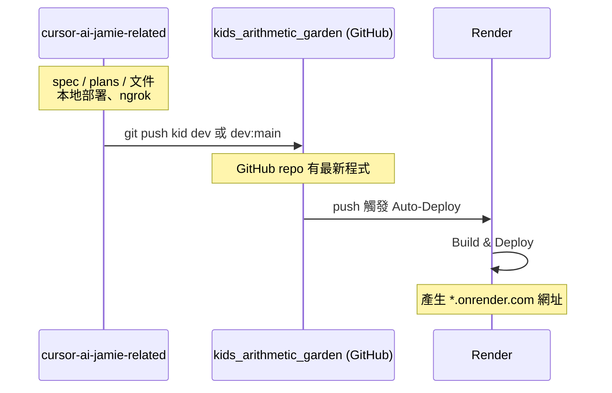

# 推送到 kids_arithmetic_garden 並部署至 Render

## 兩目錄角色


| 目錄                          | 路徑                                                                | 用途                                                       |
| --------------------------- | ----------------------------------------------------------------- | -------------------------------------------------------- |
| **cursor-ai-jamie-related** | `/Users/Mac/Documents/SourceTree Project/cursor-ai-jamie-related` | 存放 spec、plans、markdown、規格文件等；**本地部署**與 **ngrok** 在此目錄運行。 |
| **kids_arithmetic_garden**  | `/Users/Mac/Documents/SourceTree Project/kids_arithmetic_garden`  | 實際部署到 **Render** 的專案；推送到此 repo 的遠端即會觸發 Render 部署。        |


---

## 前置條件

- **cursor-ai-jamie-related**：文件與本地開發用（含 Next.js 專案、spec、plans、本地 run、ngrok）。
- **kids_arithmetic_garden**：對應的 Git 遠端（例如 GitHub）；Render 已連接該 repo，**push 上去就會部署**。

需先確認 **kids_arithmetic_garden 的遠端**：

- 若本機已有 `kids_arithmetic_garden` 目錄，在該目錄執行 `git remote -v` 可看到 `origin` 的 URL。
- 若還沒有 GitHub repo，請先在 GitHub 建立對應 repo 並記下 clone URL。

---

## 第一階段：把程式推送到 kids_arithmetic_garden 的遠端

若程式是在 **cursor-ai-jamie-related** 開發，要讓 **kids_arithmetic_garden** 的遠端也有最新程式，可在此目錄操作。

### 1. 確認要推送的 branch

要部署到 Render 的分支通常是 `main` 或 `master`（依 Render 專案設定）。可選：

- **A）直接推 dev**：Render 若已設定從 dev 部署即可。
- **B）推 main**：多數人用 main 當正式環境。

### 2. 加上 kids_arithmetic_garden 的遠端並推送

在 **cursor-ai-jamie-related** 目錄，把 kids_arithmetic_garden 的 Git 遠端 URL 加為 remote（下面用 `KID_REMOTE_URL` 代替，請換成實際 URL）：

```bash
cd /Users/Mac/Documents/SourceTree\ Project/cursor-ai-jamie-related
git remote add kid KID_REMOTE_URL
```

若選 **推 dev**：

```bash
git push kid dev
```

若本機只有 dev、但遠端要 main：

```bash
git push kid dev:main
```

之後 **kids_arithmetic_garden 在 GitHub 上的 repo** 會有這份程式碼；Render 會依設定自動觸發部署（若已開啟該分支的 Auto-Deploy）。

若本機另有 **kids_arithmetic_garden** 資料夾（該 repo 的 clone），也可在那邊 `git pull origin main`（或對應分支）後，從該目錄 `git push origin main` 觸發 Render 部署。

---

## 第二階段：Render 部署

### 1. 連接 Repo（若尚未設定）

1. 登入 [Render](https://render.com)，用 **GitHub** 連接。
2. **New → Web Service**（或對應類型）。
3. 選擇 **kids_arithmetic_garden** 對應的 GitHub repo。
4. 選好分支（例如 main 或 dev）。

### 2. 設定專案（Next.js）


| 欄位            | 建議                                                                          |
| ------------- | --------------------------------------------------------------------------- |
| Build Command | `npm run build` 或 `next build`                                              |
| Start Command | `npm run start` 或 `npm start`（依 package.json）                               |
| 環境變數          | 本專案用 IndexedDB、無後端 API key，可不設；若有 `.env` 需求再於 Render 專案 **Environment** 新增。 |


### 3. 部署

儲存設定後 Render 會執行建置並部署。之後每次 **push 到所選分支**，Render 會自動重新部署。

---

## 流程概觀




---

## 檢查清單

- 確認 **cursor-ai-jamie-related** 用於 spec/plans/文件與本地、ngrok；**kids_arithmetic_garden** 用於推送到遠端並部署到 Render。
- 取得 kids_arithmetic_garden 的 Git 遠端 URL。
- 在 cursor-ai-jamie-related 加上 `kid` remote 並 push 到要部署的分支（或從 kids_arithmetic_garden 目錄 push）。
- Render 專案已連接 kids_arithmetic_garden repo，Build/Start 指令正確。
- 若要自訂網域：Render 專案 **Settings → Custom Domains** 新增。

完成後，之後只要 push 到 kids_arithmetic_garden 的對應分支，Render 就會自動重新部署。

---

## 後續功能：花園蟲害（🐛 破壞植物）

花園進入時有機會出現 🐛 蟲害，會降低植物成長或健康度；玩家需除蟲才能恢復。

### 設計方向（建議採用）


| 方案             | 說明                                                                    | 改動量          |
| -------------- | --------------------------------------------------------------------- | ------------ |
| **A）蟲害當負面狀態**  | 像雜草一樣：有蟲時成長速率乘上懲罰係數（如 0.6），除蟲後恢復。不新增「健康度」欄位。                          | 小，與現有雜草架構一致  |
| **B）引入健康度**    | `GardenRecord` 新增 `health`（0～100），蟲害會扣健康；健康低時成長變慢，歸零可視為枯萎。澆水／施肥可恢復少許。 | 中，需新欄位與公式    |
| **C）蟲害直接扣成長值** | 有蟲時，每次進花園依經過時間從 `growthValue` 扣減（下限 0），除蟲後停止扣減。                       | 小，只動成長計算與蟲狀態 |


**建議**：先做 **A**，之後若要「救植物」的明確感再考慮 **B**。

### 蟲害觸發條件（建議）

- **時機**：進入花園時判定（與雜草類似）。
- **規則**（擇一或組合）：
  - 超過 N 天沒進花園（例如 1～2 天）則有機率生蟲；或
  - 每次進花園有機率出現（例如 10%～15%）；或
  - 僅在 `growthStage >= 1`（已有幼苗）時才可能生蟲。

### 除蟲方式（建議）

- **徒手抓蟲**：按鈕「🐛 抓蟲」+ 冷卻時間（例如 2 小時），不消耗道具，兒童友善。
- **除蟲劑**（可選）：商店新增加消耗品「除蟲劑」，使用後清除蟲害；可設較短冷卻或無冷卻，作為付費/代幣換取便利。

### 資料與程式要點

- **狀態**：在 `GardenRecord` 或類似 `gardenVisit` 的機制中記錄「是否有蟲」與「上次除蟲時間」（若用冷卻）。若採方案 B，另加 `health` 欄位與 DB 版本升級。
- **成長計算**：在 `src/persistence/garden.ts` 的 `getGrowthRate()` 中，若 `getHasBugs()` 為 true，再乘上 `BUG_PENALTY_MULTIPLIER`（例如 0.6）。若採方案 B，再依 `health` 調整係數或允許枯萎。
- **除蟲 API**：新增 `removeBugs()`（或 `catchBugs()`），清除蟲狀態、更新冷卻時間；若有除蟲劑則消耗一枚。

### UI / 體驗要點

- **蟲的表現**：有蟲時在植物或土面旁顯示 1～3 隻 🐛（或小圖），除蟲後消失。
- **提示**：有蟲時顯示「植物有蟲害，成長變慢囉！快除蟲～」。
- **除蟲反饋**：按抓蟲或使用除蟲劑後，簡短音效 + 蟲消失，並顯示「蟲蟲趕走了！」。

### 實作檢查清單（蟲害功能）

- 決定採用方案 A / B / C，以及觸發條件（天數／機率／成長階段）。
- 在 `GardenRecord` 或 gardenVisit 邏輯中新增蟲狀態與（可選）`health`。
- `getGrowthRate()` 加入蟲害懲罰；若為 B，加入健康度對成長或枯萎的影響。
- 新增 `removeBugs()`（及可選除蟲劑消耗），並在花園頁面加入「抓蟲」按鈕與冷卻顯示。
- 花園頁面有蟲時顯示 🐛 與提示文案，除蟲後隱藏並顯示成功訊息。
- （可選）商店新增除蟲劑品項與購買／使用流程。

