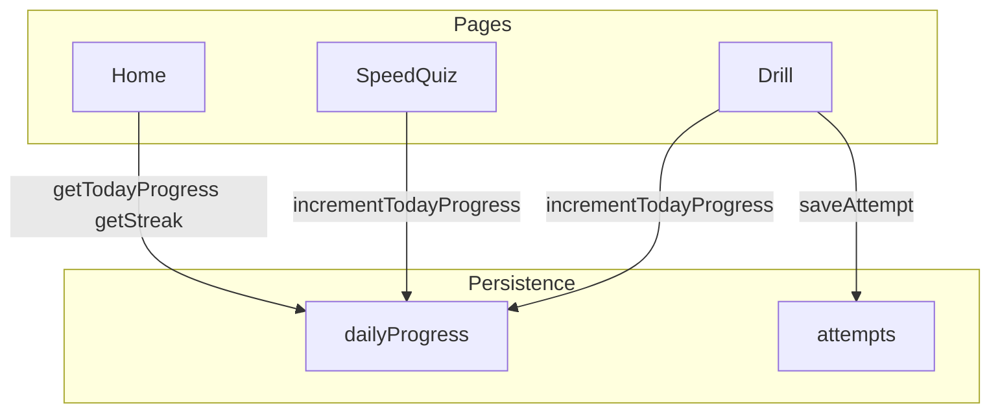

# 今日任務與 7 天連續徽章 實作計畫

## 目標

- **今日任務**：每天完成 20 題即算達成；完成時給予「今日徽章」。
- **連續獎勵**：連續 7 天都達成每日 20 題時，給予「7 天連續徽章」。
- **教育產品感**：首頁可見進度與徽章，提升回訪意願（家長與小朋友都更有動力）。

---

## 1. 資料模型與持久化

### 1.1 新 IndexedDB store：`dailyProgress`

- **Key**：`date`（字串，`YYYY-MM-DD`，以使用者當地日期為準）。
- **Value**：`{ date: string, questionsCompleted: number, completedAt?: number }`
  - `questionsCompleted`：該日已答題數（Drill 與 Times Table 速度測驗都計入）。
  - `completedAt`：當日首次達到 20 題的時間戳（用於顯示「今日任務完成」與徽章）。

### 1.2 檔案與 API

- `**[src/persistence/db.ts](src/persistence/db.ts)**`  
  - 將 DB version 升級（例如 2），在 `upgrade` 中新增 store `dailyProgress`（keyPath: `date`）。  
  - 在 `KidArithmeticDB` 型別與 `ExportData` 中納入 `dailyProgress`（若沿用現有 export 結構）。
- **新檔 `[src/persistence/dailyProgress.ts](src/persistence/dailyProgress.ts)**`  
  - `getTodayProgress(): Promise<{ questionsCompleted: number; goal: number; completed: boolean }>`  
    - 以當地 `YYYY-MM-DD` 取當日記錄，`goal` 固定 20，`completed = questionsCompleted >= 20`。
  - `incrementTodayProgress(): Promise<{ questionsCompleted: number; justCompleted: boolean }>`  
    - 對當日 `questionsCompleted` +1；若從 19→20，設 `completedAt` 並回傳 `justCompleted: true`。
  - `getStreak(): Promise<number>`  
    - 由 `dailyProgress` 讀取所有「已完成日」（`questionsCompleted >= 20`），依日期排序，計算以「今天」或「昨天」為結尾的連續天數。
  - `getRecentBadgeDays(): Promise<string[]>`  
    - 回傳最近有 `completedAt` 的日期陣列（用於首頁顯示近期徽章／打勾）。
- **Export/Import**  
  - `[src/persistence/export-import.ts](src/persistence/export-import.ts)`：匯出／匯入時一併處理 `dailyProgress`，確保備份還原後 streak 與徽章仍正確。

---

## 2. 何時計數「一題」

- **Drill 模式**：現有 `[app/drill/page.tsx](app/drill/page.tsx)` 在 `saveAttempt` 成功後，多呼叫一次 `incrementTodayProgress()`（每答一題計一次，不論對錯）。
- **Times Table 速度測驗**：在 `[src/components/SpeedQuiz.tsx](src/components/SpeedQuiz.tsx)` 的 `handleSubmit` 中，每次送出答案後呼叫 `incrementTodayProgress()`（同樣每題計一次）。
- **Times Table 閃卡**：不計入（僅翻面，無答題送出），與「完成 20 題」定義一致。

---

## 3. UI 元件與頁面

### 3.1 首頁「今日任務」區塊

- `**[app/page.tsx](app/page.tsx)**`  
  - 在「練習題 / 九九乘法」按鈕上方或下方加入「今日任務」卡片（client 端用 `getTodayProgress()`、`getStreak()` 取得資料）。  
  - 內容建議：  
    - 標題：「今日任務」或「今天的目標」。  
    - 進度：「今天已完成 **X / 20** 題」＋進度條（例如 20 格或長條）。  
    - 若 X &lt; 20：「再 **N** 題就完成今日任務！」。  
    - 若 X &gt;= 20：「今日任務完成！」＋顯示今日徽章（小圖示或文字）。
  - 下方可顯示：「已連續 **K** 天完成」（K 由 `getStreak()` 來）；若 K &gt;= 7，可加一句「7 天連續達成！」或顯示 7 天徽章。

### 3.2 完成當日 20 題當下的回饋

- **選項 A（推薦）**：在 `incrementTodayProgress()` 回傳 `justCompleted: true` 時，由呼叫端（Drill 頁或 Speed Quiz）觸發一次「今日任務完成」的小慶祝：  
  - 例如在 Drill 的 `handleDismissFeedback` 或下一題前、Speed Quiz 的 `handleDismissFeedback` 後，檢查 `justCompleted`，若為 true 則顯示一個小 modal／toast：「今日任務完成！獲得今日徽章。」（可搭配現有音效或簡短動畫）。
- **選項 B**：不做即時彈出，僅在回到首頁時看到「今日任務完成」與徽章。  
- 實作上可在 Drill / SpeedQuiz 內呼叫 `incrementTodayProgress()` 後依回傳值決定是否顯示「任務完成」toast。

### 3.3 7 天連續徽章

- 當 `getStreak()` &gt;= 7 時，在首頁「今日任務」區塊中顯示「7 天連續達成」徽章（圖示或文字）。  
- 可選：在 `incrementTodayProgress()` 發現今日剛完成且新的 streak 剛好 &gt;= 7 時，顯示一次「7 天連續獎勵！」的 toast（與今日徽章分開或合併一句話皆可）。

### 3.4 元件拆分（可選）

- 將「今日任務」卡片抽成 `**[src/components/TodayTask.tsx](src/components/TodayTask.tsx)**`：接收 `progress`、`streak` 等 props，或內部自呼叫 `getTodayProgress` / `getStreak`，方便首頁與未來其他頁重用。

---

## 4. 資料流概觀

- 首頁僅讀取 `dailyProgress` 顯示進度與 streak；Drill / Speed Quiz 在每答一題時寫入 `dailyProgress`。

---

## 5. 實作順序建議

1. **DB 與 API**：在 `db.ts` 升級 version、新增 `dailyProgress` store；實作 `dailyProgress.ts`（`getTodayProgress`、`incrementTodayProgress`、`getStreak`、`getRecentBadgeDays`）；更新 export/import 包含 `dailyProgress`。
2. **計數整合**：在 Drill 的 `saveAttempt` 成功後呼叫 `incrementTodayProgress()`；在 SpeedQuiz 的 `handleSubmit` 內呼叫 `incrementTodayProgress()`。
3. **首頁 UI**：新增今日任務卡片（可先用元件 `TodayTask`），顯示 X/20、進度條、連續 K 天、今日完成與 7 天徽章狀態。
4. **即時回饋**：依 `incrementTodayProgress()` 的 `justCompleted` 在 Drill / SpeedQuiz 顯示「今日任務完成」toast；可選在 streak 剛達 7 時顯示 7 天徽章 toast。
5. **小 polish**：徽章樣式（CSS 或簡單 SVG/emoji）、文案與 README 簡短說明「今日任務」與連續獎勵。

---

## 6. 注意事項

- **時區**：一律用使用者本地日期（`new Date()` + 手動取 YYYY-MM-DD 或 `toLocaleDateString` 等），避免因 UTC 導致「昨天／今天」錯位。
- **匯出／匯入**：`dailyProgress` 一併匯出與匯入，避免換機或還原後 streak 與徽章遺失。
- **隱私**：資料仍全部存於本機，無後端與登入，符合現有設計。

此計畫可直接對應至既有 [kid_arithmetic_web_app_16439ff5.plan.md](.cursor/plans/kid_arithmetic_web_app_16439ff5.plan.md) 的 Persistence 與首頁／Drill／Times Table 流程，不改變既有 Generator、Adaptive 與題目邏輯。