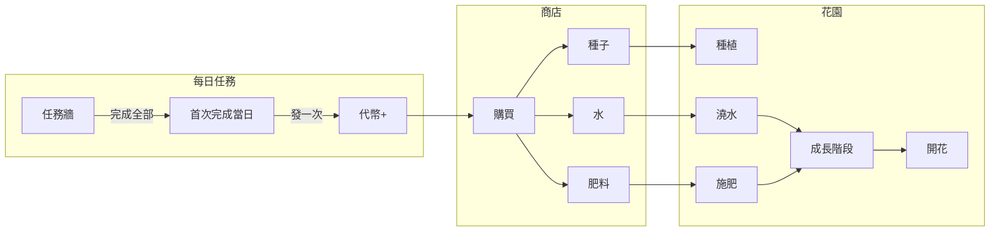

# 代幣、商店、養花功能與免費圖源計畫

## 一、免費花朵／種子圖源（供教學遊戲使用）

專案已有一份慶祝素材說明 [public/celebration-assets/README.md](public/celebration-assets/README.md)，建議**新增** `public/garden-assets/README.md`，集中列出以下免費可下載來源，方便你或協作者手動下載後放入 `public/garden-assets/` 使用。

| 類型           | 來源                         | 說明                                            | 授權／備註            |
| ------------ | -------------------------- | --------------------------------------------- | ---------------- |
| 種子／植物成長階段    | **Vecteezy**               | 搜尋 "seed growing"、"flower growth stages"      | 免費 PNG/向量，注意個別授權 |
| 植物生命週期       | **Pngtree**                | 搜尋 "plant life cycle"、"sunflower germination" | 大量 PNG，透明背景，部分免費 |
| 花朵／種子圖示      | **Freepik**                | 搜尋 "flower seed"、"plant growth stages"        | 免費需標註／付費免標註      |
| 圖示 (PNG/SVG) | **Noun Project**           | 搜尋 "flower seeds"、"plant seed"                | 免費可商用，部分需標註      |
| 通用免費圖        | **Pixabay**、**Unsplash**   | 搜尋 "flower"、"seed"、"plant growth"             | 多為 CC0／免費商用      |
| 遊戲素材         | **Kenney**、**OpenGameArt** | 搜尋 "plant"、"flower"、"seed"                    | CC0 友善，適合遊戲      |

**建議資料夾結構**（與 [public/celebration-assets/](public/celebration-assets/) 模式一致）：

- `public/garden-assets/`：放置實際使用的圖片（種子、成長階段、開花圖）。
- `public/garden-assets/README.md`：上述表格與下載方式、建議檔名（例如 `seed-rose.png`、`growth-0.png`～`growth-N.png`、`flower-rose.png`），以及程式中引用路徑說明（如 `/garden-assets/檔名.png`）。

程式內以「路徑 + 種子 id／成長階段」決定顯示哪張圖；未放置檔案時可用 CSS 或簡單 placeholder（色塊＋文字）不影響功能。

---

## 二、功能架構與資料流

- **代幣**：完成每日任務牆後，**當日首次完成**發一次代幣，避免重複領取。
- **商店**：代幣可購買種子（不同 id 對應不同花）、水、肥料（一般／高級）；扣代幣、背包數量 +1。
- **花園**：種下種子後有一株植物；澆水／施肥推進成長；成長公式可依「距上次澆水／施肥」與肥料等級計算；達最後階段即開花，外觀由種子 id 決定。

---

## 三、資料與持久化（IndexedDB）

在 [src/persistence/db.ts](src/persistence/db.ts) 升級 DB version，新增三個 store（或依你偏好合併為兩個，見下）：

| Store         | Key                   | Value 概念                                                                                                    |
| ------------- | --------------------- | ----------------------------------------------------------------------------------------------------------- |
| **wallet**    | 單一 key（如 `"default"`） | `{ coins: number, lastRewardDate?: string }`，記錄代幣與最後領獎日期                                                    |
| **inventory** | 單一 key 或 userId       | `{ water: number, fertilizerBasic: number, fertilizerPremium: number, seeds: Record<seedId, number> }`，背包數量 |
| **garden**    | 單一 key（一株植物）          | `{ seedId, plantedAt, growthStage, lastWateredAt?, lastFertilizedAt?, fertilizerType? }`                    |

- **每日獎勵只發一次**：發代幣時寫入 `lastRewardDate = getTodayDateString()`；讀取時若當日已完成任務且 `lastRewardDate !== today` 才發放並更新。
- 匯出／匯入：[src/persistence/export-import.ts](src/persistence/export-import.ts) 需一併處理 wallet、inventory、garden，與現有 dailyProgress 相同模式。

---

## 四、任務完成時發代幣的銜接點

- 目前 [incrementTaskProgress](src/persistence/dailyProgress.ts) 在任務牆**全部完成**時會回傳 `justCompleted: true`，且 [Drill](app/drill/page.tsx) / [SpeedQuiz](src/components/SpeedQuiz.tsx) 已有 `justCompleted` 時顯示「今日任務完成」toast。
- **建議**：在同樣的 `justCompleted` 分支呼叫新 API `claimDailyRewardIfEligible()`（或類似名稱）：
  - 若今日尚未領過（依 wallet 的 `lastRewardDate` 與 `getTodayDateString()` 比較），則 `coins += 每日獎勵數`，並更新 `lastRewardDate`。
  - 回傳 `{ claimed: boolean, newCoins: number }`，方便 UI 顯示「獲得 N 代幣！」。

這樣不需改動現有任務牆邏輯，只「接到」完成事件並發一次代幣。

---

## 五、商店設計（種子、水、肥料）

- **種子**：至少 2～3 種（例如玫瑰、向日葵、鬱金香），每種有 `id`、`name`、`price`、開花時的 `flowerType`（對應一張圖或 id）。
- **水**：單一品項，單價固定，購買後 inventory 的 `water` +1（或 +N）。
- **肥料**：兩種——一般、高級；價格與成長加成不同，購買後對應 `fertilizerBasic` 或 `fertilizerPremium` +1。
- 購買流程：檢查代幣 >= 價格 → 扣代幣、增加對應背包數量；不足時可禁用按鈕或 toasts 提示。

---

## 六、花園與成長邏輯

- **種植**：從背包選擇一顆種子（數量 -1），寫入 garden：`seedId`、`plantedAt`、`growthStage = 0`。
- **澆水**：消耗 1 水，更新 `lastWateredAt`；可限制每日最多澆水 1 次（或 N 次）以簡化公式。
- **施肥**：選擇一般或高級，消耗對應數量，更新 `lastFertilizedAt`、`fertilizerType`。
- **成長公式**（建議簡化）：
  - 每日結算或每次進入花園時：依「自上次澆水／施肥經過天數」與「是否有施肥、肥料等級」計算本日成長值，累加到 `growthStage`。
  - 例如：只澆水 +0.2/天，一般肥 +0.3/天，高級肥 +0.5/天；`growthStage` 達上限（如 5）即設為「已開花」，並鎖定顯示對應 `seedId` 的開花圖。
- **開花後**：可保留當前植物展示，或提供「收成」後清空花園、可再種新種子（依產品需求二選一或都做）。

---

## 七、UI 與路由

- **首頁**：在 [TodayTask](src/components/TodayTask.tsx) 旁或下方顯示目前代幣；今日任務完成且剛領獎時可短暫顯示「獲得 N 代幣！」。
- **商店頁**：新路由如 `/shop`，列出種子／水／肥料、價格、購買按鈕；顯示當前代幣與背包數量（可簡化為只顯示「水 x N」等）。
- **花園頁**：新路由如 `/garden`，顯示當前植物（依 `growthStage` + `seedId` 選圖）、澆水／施肥按鈕（有庫存才可點）；未種植時顯示「選擇種子種植」並從背包選種子。
- 導航：首頁可加「商店」「我的花園」連結，與現有「練習題」「九九乘法」並列或放在次要區塊。

---

## 八、免費圖源與程式的銜接

- 所有花朵／種子／成長階段圖片路徑建議集中成常數（例如 `GARDEN_ASSETS.seed[seedId]`、`GARDEN_ASSETS.growth[stage]`、`GARDEN_ASSETS.flower[flowerType]`），對應到 `public/garden-assets/` 下的檔名。
- README 中說明的建議檔名與目錄結構要與這些常數一致，方便替換或新增種類時只改配置與放檔。
- 未放置圖片時：可回退到單一 placeholder 圖或 CSS 色塊＋文字（例如「玫瑰」「第 2 階段」），避免 404。

---

## 九、實作順序建議

| 階段                   | 內容                                                                               |
| -------------------- | -------------------------------------------------------------------------------- |
| **1. 素材說明**          | 新增 `public/garden-assets/README.md`，整理免費圖源表格、建議檔名與引用方式（不強制先有圖檔）。                 |
| **2. 代幣與每日獎勵**       | 新增 wallet store 與 API；`justCompleted` 時呼叫 `claimDailyRewardIfEligible()`；首頁顯示代幣。 |
| **3. 商店**            | 定義種子／水／肥料資料與價格；inventory store；購買 API；商店頁 UI。                                    |
| **4. 花園**            | garden store；種植／澆水／施肥 API；成長公式與階段更新；花園頁 UI；圖片路徑常數與 fallback。                     |
| **5. 匯出／匯入與 polish** | wallet、inventory、garden 加入 export/import；代幣／領獎／開花等文案與簡單動效。                       |

依此順序可先讓「完成任務 → 代幣 → 商店」跑通，再接花園與圖片，最後補齊 README 與實際下載的圖檔，教學遊戲就能更生動且易於擴充不同花朵種子。